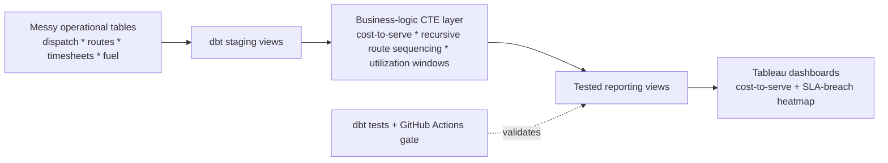

# field-ops-sql-cost-audit

**A dbt + SQL analytics project that reconciles messy field-operations data into a true cost-to-serve per job and route - and surfaces where SLA breaches actually concentrate.**


## The problem

Logistics, field-service, and delivery operators need two answers they usually can't get: *what does it truly cost to serve each job/route?* and *where do our SLA breaches actually concentrate?* The data that would answer them lives across disconnected operational tables - dispatch, routes, timesheets, fuel, tickets - in inconsistent shapes. So finance guesses at margins and ops can't see the pattern behind the breaches.

`field-ops-sql-cost-audit` is the analytics layer that reconciles it. It models the raw operational tables through a tested dbt pipeline into cost-to-serve and SLA-breach reporting views, with the hard SQL - recursive route sequencing, utilization windows, cost allocation - done once, correctly, and under test.

## Architecture



## Quick start

Requires Python 3.11+. Runs fully offline on DuckDB with synthetic data - no warehouse, no credentials.

```bash
pip install -r requirements.txt

# Generate the synthetic operational dataset
python data_generation/generate_data.py

# Build the dbt models (staging -> logic -> reporting) into DuckDB
cd dbt_project && dbt build

# Run the test suite (SQL logic + dbt build + data-generation tests)
python -m pytest -q
```

## How it works

- **Synthetic data** (`data_generation/`) produces a realistic, messy operational dataset so the whole thing runs without a real warehouse.
- **dbt models** (`dbt_project/`) layer the transform: staging views clean the raw tables, a business-logic layer computes cost-to-serve, sequences routes recursively, and derives utilization over time windows, and the reporting layer exposes analysis-ready views.
- **Recursive SQL + window functions** do the genuinely hard parts (route ordering, rolling utilization) - the kind of SQL that separates a data analyst from a spreadsheet.
- **Tested**: `tests/` runs SQL-logic assertions against DuckDB plus dbt build/data checks, and `.github/workflows/ci.yml` gates every push - so a schema change fails loudly instead of silently corrupting a dashboard.
- **Tableau** (`tableau/`) consumes the reporting views for the cost-to-serve explorer and the SLA-breach heatmap by region and time-of-day.

## Tech

PostgreSQL / DuckDB - SQL (recursive CTEs, window functions) - dbt - Tableau - Python

## Maintainer

Lavanya Tadisina is a Business Analyst with over 4 years of experience delivering data-driven solutions, process optimization, and requirements management across enterprise environments. Specializing in SQL, Tableau, and Agile methodologies, she maintains this project as a framework for reconciling complex operational data into actionable business intelligence.

Contact: tadisinalavanya@gmail.com